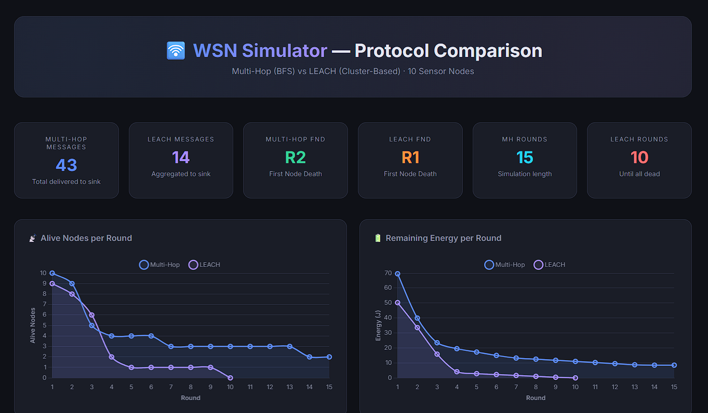
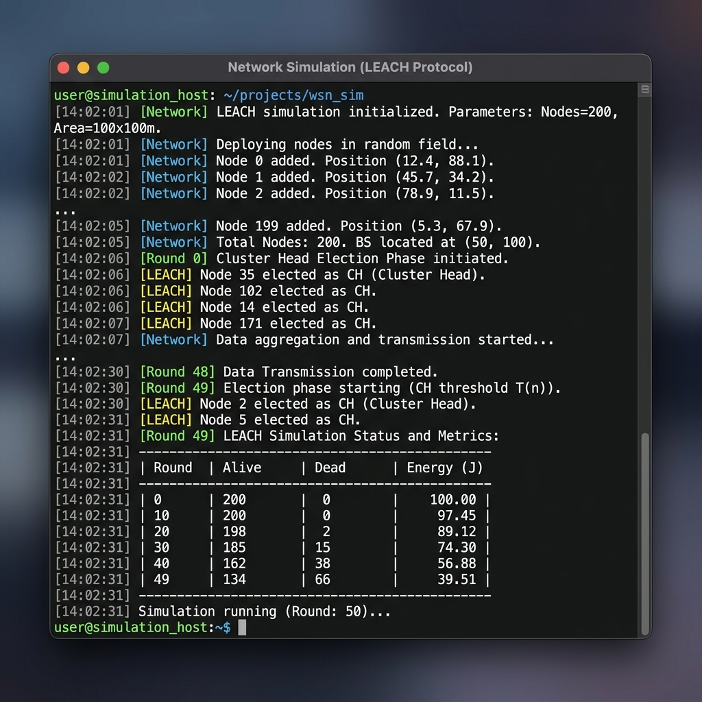

# 🛜 WSN Simulator

A **Wireless Sensor Network (WSN)** simulator built in C++ that models sensor node communication, energy consumption, and data routing. It implements and compares two routing protocols — **Multi-Hop (BFS)** and **LEACH (Cluster-Based)** — with full metrics tracking and an auto-generated interactive HTML report.

---

## ✨ Features

| Feature | Description |
|---|---|
| **Multi-Hop Routing** | BFS shortest-path routing from sensor nodes to the sink via relay hops |
| **LEACH Protocol** | Cluster head election with the standard threshold formula, data aggregation, and CH rotation |
| **Distance-Based Energy** | Transmission cost follows `E_tx = E_elec + E_amp × d²` (free-space model) |
| **Neighbor Discovery** | Euclidean distance-based topology with configurable communication range |
| **Simulation Metrics** | Per-round tracking of alive/dead nodes, remaining energy, messages delivered, average hops |
| **CSV Export** | Round-by-round data exported to CSV for external analysis (Excel, matplotlib, etc.) |
| **HTML Visual Report** | Auto-generated interactive dashboard with Chart.js comparing both protocols |
| **Modern C++17** | Smart pointers, `const` correctness, `<random>` RNG, RAII resource management |

---

## 📊 Visual Dashboard

The simulator auto-generates a high-end, interactive HTML dashboard comparing protocol performance.



## 🖥️ Terminal Simulation

Real-time terminal output with formatted tables and event logging.



---

## 🏗️ Architecture

```
┌─────────────────────────────────────────────────────────┐
│                      Network                            │
│  ┌──────────┐  ┌──────────┐       ┌──────────┐         │
│  │ SensorNode│  │ SensorNode│  ... │ SensorNode│         │
│  │  (id=1)  │  │  (id=2)  │      │  (id=N)  │         │
│  └────┬─────┘  └────┬─────┘      └────┬─────┘         │
│       │              │                  │               │
│       │    Multi-Hop (BFS relay)        │               │
│       │       or LEACH (via CH)         │               │
│       └──────────────┼──────────────────┘               │
│                      ▼                                  │
│               ┌──────────┐                              │
│               │ SinkNode │  (Central aggregator)        │
│               │  (id=0)  │                              │
│               └──────────┘                              │
└─────────────────────────────────────────────────────────┘
```

### Class Hierarchy

```
Node (abstract base)
├── SensorNode — Senses data, relays messages, manages energy
└── SinkNode   — Receives and aggregates all messages

Network        — Manages topology, routing, and simulation loop
Message        — Data packet with sender ID, payload, and hop count
Config         — Centralized simulation parameters
ReportGenerator— Generates HTML visual report with Chart.js
```

---

## 📂 Project Structure

```
WSN/
├── Config.h              # Simulation parameters (energy costs, defaults)
├── Message.h / .cpp      # Data packet class
├── Node.h / .cpp         # Abstract base node (position, energy, distance)
├── SensorNode.h / .cpp   # Sensor node (neighbors, routing, LEACH, energy model)
├── SinkNode.h / .cpp     # Sink node (data aggregation, stats)
├── Network.h / .cpp      # Network manager (BFS routing, LEACH, metrics, CSV)
├── ReportGenerator.h/.cpp# HTML report generator with embedded Chart.js
├── main.cpp              # Entry point — runs both protocols & generates report
├── README.md             # This file
└── .gitignore            # Build artifacts exclusion
```

---

## 🚀 Getting Started

### Prerequisites

- **C++17** compatible compiler (g++ 7+, MSVC 2017+, Clang 5+)

### Build & Run

```bash
# Compile
g++ -std=c++17 -o wsn.exe Message.cpp Node.cpp SensorNode.cpp SinkNode.cpp Network.cpp ReportGenerator.cpp main.cpp

# Run
./wsn.exe
```

### Output Files

After running, the simulator generates:

| File | Description |
|---|---|
| `wsn_multihop.csv` | Per-round stats for Multi-Hop protocol |
| `wsn_leach.csv` | Per-round stats for LEACH protocol |
| `wsn_report.html` | **Interactive HTML dashboard** — open in any browser |

---

## 📊 Protocols Compared

### Multi-Hop (BFS Routing)

- Uses **Breadth-First Search** from the sink to compute shortest-hop paths
- Each sensor node forwards data hop-by-hop through relay nodes to the sink
- Relay nodes near the sink consume more energy (**energy hole problem**)
- Routes are recomputed each round as nodes die

### LEACH (Low Energy Adaptive Clustering Hierarchy)

- Each round, nodes **self-elect as Cluster Heads** using the LEACH threshold:
  ```
  T(n) = p / (1 - p × (r mod ⌊1/p⌋))
  ```
- Non-CH nodes join their **nearest CH** and send data to it
- CHs **aggregate** member data and transmit a single message to the sink
- CH role **rotates** each cycle to balance energy consumption across the network

---

## ⚡ Energy Model

The simulator uses a simplified **free-space radio model**:

| Action | Energy Cost |
|---|---|
| Data collection (sensing) | `E_COLLECT = 0.2 J` |
| Transmission electronics | `E_ELEC = 0.05 J` |
| Transmission amplifier | `E_AMP = 0.01 × d² J` |
| Reception | `E_RECEIVE = 0.1 J` |
| Data aggregation (CH only) | `E_AGGREGATE = 0.05 J` |

All parameters are configurable in [`Config.h`](Config.h).

---

## 📈 Metrics Tracked

| Metric | Description |
|---|---|
| **Alive / Dead Nodes** | Network survivability per round |
| **Total Energy Remaining** | Aggregate energy across all alive nodes |
| **Messages Delivered** | Successful transmissions reaching the sink |
| **Average Hops** | Mean hop count per delivered message |
| **First Node Death (FND)** | Round when the first node runs out of energy |
| **Last Node Death (LND)** | Round when the last node dies |

---

## 🛠️ Configuration

Edit [`Config.h`](Config.h) to tune simulation parameters:

```cpp
namespace Config {
    constexpr float E_COLLECT    = 0.2f;   // Sensing cost
    constexpr float E_ELEC       = 0.05f;  // Electronics cost
    constexpr float E_AMP        = 0.01f;  // Amplifier factor (× d²)
    constexpr float E_RECEIVE    = 0.1f;   // Reception cost
    constexpr float E_AGGREGATE  = 0.05f;  // Aggregation cost
    constexpr float SINK_ENERGY  = 9999.0f;
    constexpr float DEFAULT_RANGE = 15.0f;
}
```

Modify [`main.cpp`](main.cpp) to change:
- Number of nodes and their positions
- Initial energy levels
- Communication range
- Number of simulation rounds
- LEACH probability parameter `p`

---

## 📚 References

- W. Heinzelman, A. Chandrakasan, H. Balakrishnan, *"Energy-Efficient Communication Protocol for Wireless Microsensor Networks"*, IEEE HICSS, 2000.
- W. Heinzelman, A. Chandrakasan, H. Balakrishnan, *"An Application-Specific Protocol Architecture for Wireless Microsensor Networks"*, IEEE Transactions on Wireless Communications, 2002.

---

## 📝 License

This project is open source and available under the [MIT License](LICENSE).
